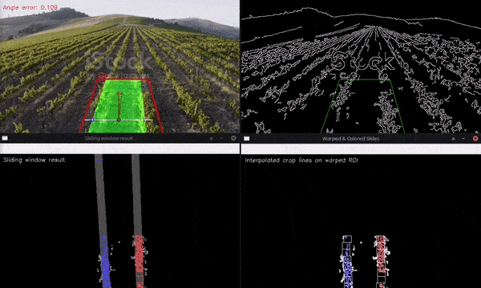

# Computer vision approach for crop-line detection and heading angle error estimation

## How the algorithm works (high level)

This detector treats a crop field like a lane-detection problem: the camera
drives between two crop rows, and the "lane" is the soil corridor between
them. For every frame it answers: *"how many degrees am I off from the
corridor's direction?"*

1. **Edges** - the frame is grayscaled, blurred, and passed through a Canny
   filter, keeping the strong plant/soil edges.
2. **ROI** - everything outside a trapezoid at the bottom of the frame (the
   patch of ground right in front of the vehicle) is masked out. Crop rows
   at the image borders are irrelevant for navigation and only add noise.
3. **Bird's-eye warp** - the trapezoid is perspective-warped into a rectangle
   so the converging crop rows become roughly parallel vertical lines.
4. **Histogram peaks** - pixel counts are summed per column over the lower
   half; the two strongest peaks left and right of center are the starting
   x-positions of the left and right crop lines.
5. **Sliding windows** - a stack of small windows climbs from the bottom,
   each window recentering on the mean x of the edge pixels found in the
   previous one. This traces both crop lines through the warped image.
6. **Polynomial fit** - all window pixels are fitted with a degree-1 (or
   configurable) polynomial per side; a second pass re-selects pixels near
   the fitted lines and refits, with a moving average over recent frames to
   keep the lines stable.
7. **Back to the real view** - the area between the two fitted lines is
   filled, warped back to the original perspective, and overlaid (green
   corridor in the demo GIF).
8. **Heading angle error** - two horizontal evaluation lines cross the
   corridor near the bottom; their midpoints define the corridor's current
   center and its goal direction. The angle between the vehicle's straight-
   ahead arrow and the corridor direction is the heading angle error the
   controller should correct by.

## What the code does

- `scripts/cropLineDetector.py` - the algorithm, packaged as the
  `cropLineDetector` class. Feed it frames via `get_heading_angle_error()`;
  it returns the heading angle in radians. Bitmask `viz_options` flags
  (`DRAW_FINAL_RESULT`, `DRAW_WINDOWS_ON_FRAME`, `DRAW_SLIDING_WINDOW_RESULT`,
  `DRAW_CENTER_ESTIMATIONS`, ...) control what gets visualized. Pass
  `display=False` for headless runs - no GUI windows are opened, and the last
  annotated frame is always available as `detector.last_frame`.
- `scripts/main.py` - entry point. Runs the detector over a **video** (frame
  by frame, printing the angle) or a **folder/glob of images** (each image is
  an independent scene, so each gets a fresh detector), saving annotated
  overlays and a CSV of angles.

```bash
# batch over the shared Photos folder -> ./results
python3 scripts/main.py --input ../../Photos --results_dir ./results

# original video demo (GUI windows, press q to quit)
python3 scripts/main.py                      # uses images/crops.mp4
python3 scripts/main.py --input path/to/video.mp4 --display
```

- `results/` - outputs from the image batch: `<name>_result.png` overlays
  (green corridor + center/goal arrows + angle text) and
  `crop_line_detection_data.csv` (heading angle error per image).

## Demo



> This is produced with viz_options =  DRAW_FINAL_RESULT | DRAW_SLIDING_WINDOW_RESULT | DRAW_ANGLE_ERROR_ON_IMAGE | DRAW_WINDOWS_ON_FRAME | DRAW_CENTER_ESTIMATION

## Quickstart

run ``` python3 scripts/main.py```

Press **q** to exit the program

Press **any other key** to show the result on the next frame
